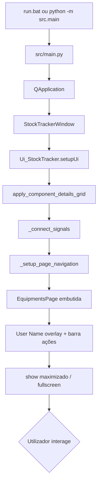

# Fluxograma — Arranque da aplicação

| Passo | Ficheiro | Notas |
|-------|----------|-------|
| Entrada | `src/main.py` | Não executar `gui/*.py` diretamente |
| Lógica Excel | `src/core/stock.py` | `StockTracker()` no `__init__` da janela |
| Layout Components | `gui_stocktracker.ui` | Grelha 5 colunas, imagem à direita |
| Layout Equipments | `gui_equipments.ui` | Página no `QStackedWidget` |
