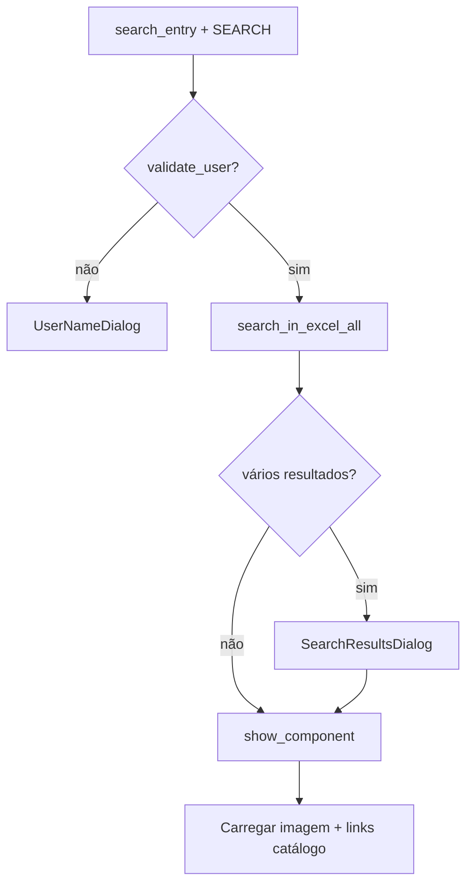
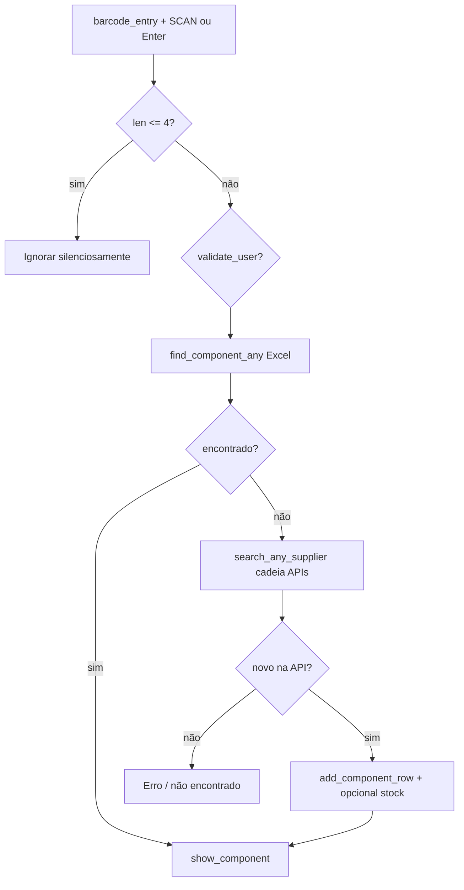
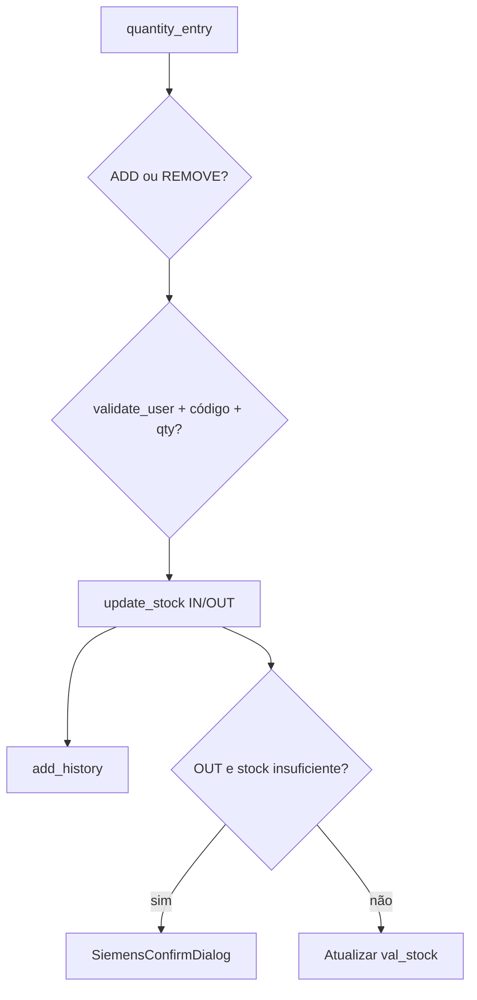
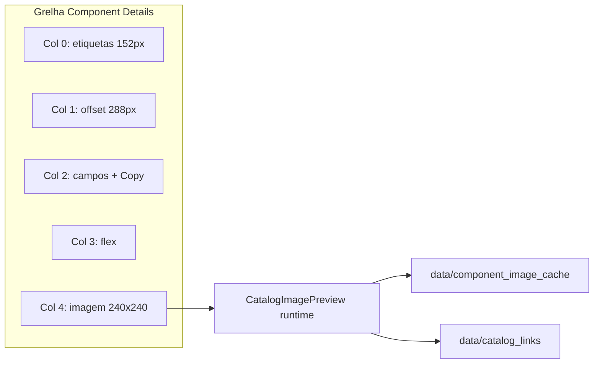

# Fluxograma — Página Components

## Pesquisa manual (SEARCH)

## SCAN / código de barras

## Stock IN / OUT

## Detalhes e imagem (layout atual)

| Ação UI | Comportamento |
|---------|----------------|
| Campo detalhe **vazio** + clique | Abre ADD MANUAL |
| Campo detalhe **preenchido** + clique | Sem ação (usar EDIT) |
| WEB / Datasheet | URLs em cache; confirmação antes de abrir PDF |
| Operations ordem | Scan → Quantity → Stock Actions |
