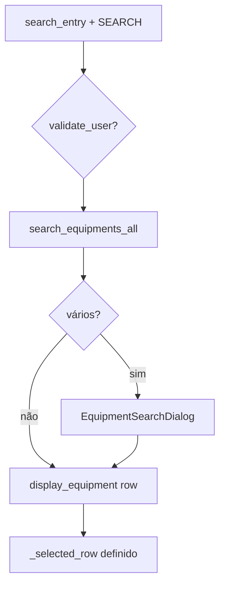
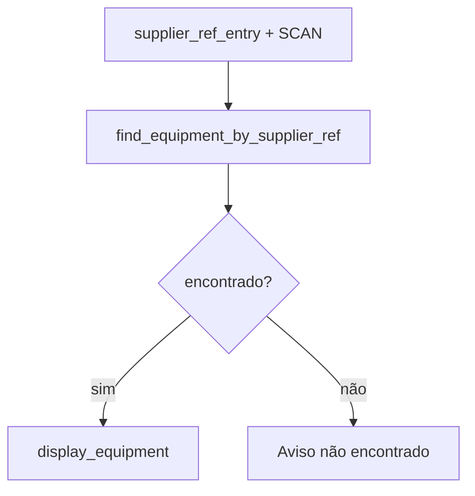
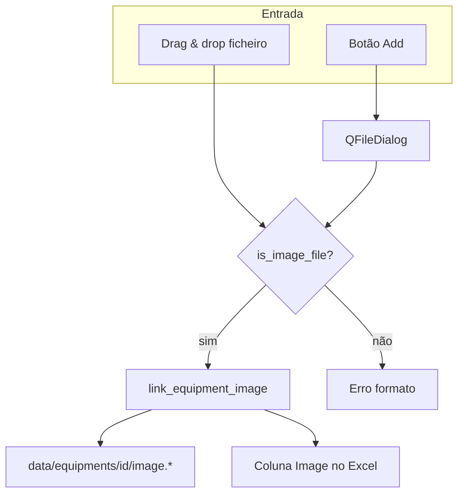
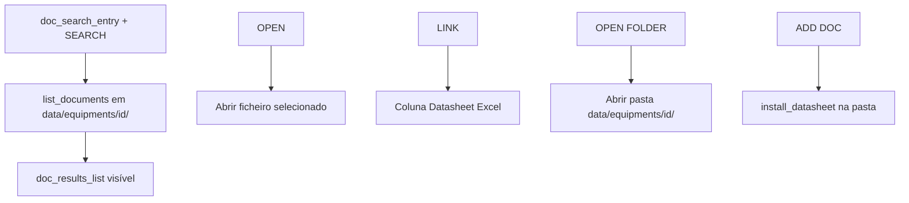

# Fluxograma — Página Equipments

## Pesquisa e seleção

## SCAN supplier reference

## Imagem do equipamento

Caixa de imagem (`.ui`): **300×320 px** mínimo (`EQUIPMENT_IMAGE_PREVIEW_HEIGHT` em `styles.py`).

## Documentação de suporte

| Campo detalhe vazio + clique | ADD Equipment |
|------------------------------|---------------|
| Campo preenchido + clique | Sem ação (usar EDIT) |
