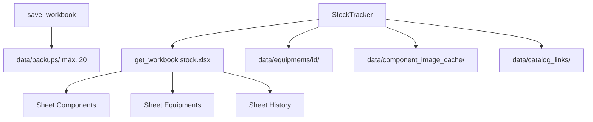

# Fluxograma — Excel e pastas `data/`

## Folhas Excel

| Sheet | Colunas principais |
|-------|-------------------|
| **Components** | ID, Supplier Ref, Manufacturer, Mfr Ref, Value, Description, Stock |
| **Equipments** | ID, Supplier Ref, Serial, **Name**, Description, Calib Date, Calib Expiry, **Datasheet**, **Image** |
| **History** | Date, User, Supplier Ref, Movement, Quantity, Stock After |

## Pastas locais (gitignore parcial)

| Pasta | Uso |
|-------|-----|
| `data/equipments/{id}/` | Datasheet + imagem por equipamento |
| `data/component_image_cache/` | Cache imagens catálogo (Components) |
| `data/catalog_links/` | Cache URLs WEB/datasheet |
| `data/backups/` | Cópias automáticas antes de gravar |

`data/support_documentation/` — pasta legada opcional. Imagens de equipamentos: **`data/equipments/{id}/`** (não `data/equipment_images/`).

Detalhe: [../../data/README.md](../../data/README.md)
