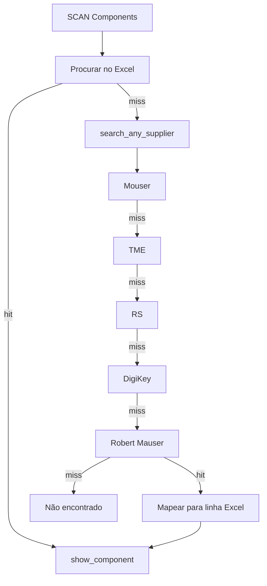

# Fluxograma — Fornecedores (SCAN Components)

| Módulo | Pasta |
|--------|-------|
| Orquestração | `src/core/stock.py` |
| Implementações | `src/core/suppliers/*.py` |
| Credenciais | `config/secrets.py` |

Configuração e testes: [../user/SUPPLIERS.md](../user/SUPPLIERS.md)

**Nota:** A página Equipments **não** usa SCAN de fornecedores — apenas Excel local.
