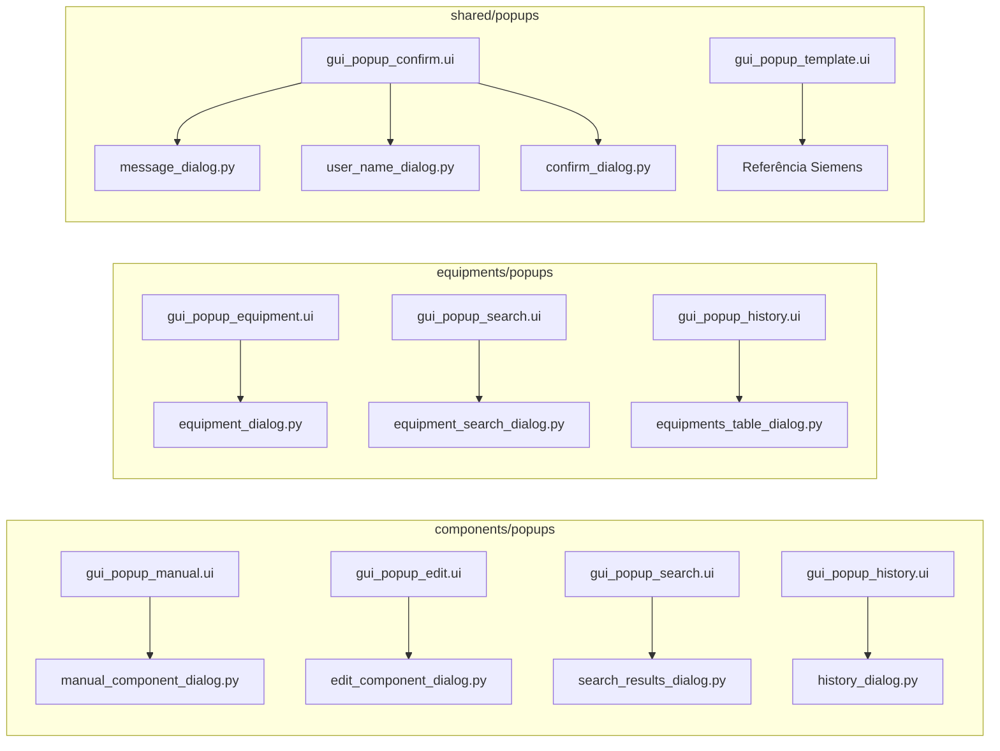

# Fluxograma — Popups e diálogos

## Mapa `.ui` → Python

## DESIGNER.bat — opções 3–11

| Opção | Ficheiro |
|-------|----------|
| 3 | `popups/components/gui_popup_manual.ui` |
| 4 | `popups/components/gui_popup_edit.ui` |
| 5 | `popups/components/gui_popup_search.ui` |
| 6 | `popups/components/gui_popup_history.ui` |
| 7 | `popups/equipments/gui_popup_equipment.ui` |
| 8 | `popups/equipments/gui_popup_search.ui` |
| 9 | `popups/equipments/gui_popup_history.ui` |
| 10 | `popups/shared/gui_popup_confirm.ui` |
| 11 | `popups/shared/gui_popup_template.ui` |

Canonical: `src/gui/designer/popups/` · Pacote edição: `StockTracker-Designer/popups/`
