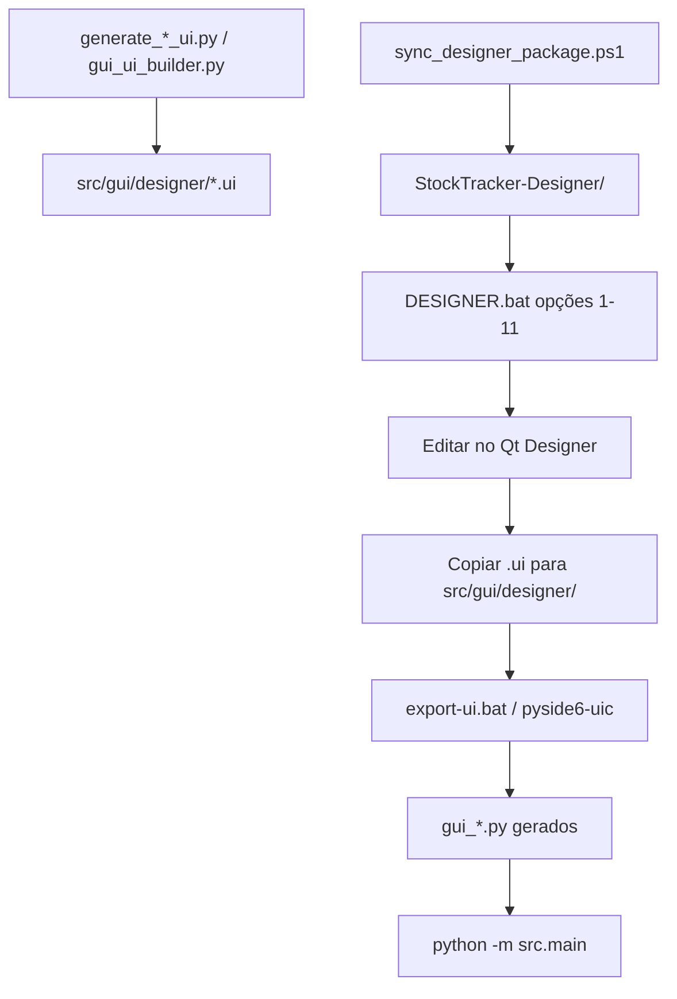

# Fluxograma — Qt Designer (workflow)

## Páginas principais

| Opção | Ficheiro | Gerador |
|-------|----------|---------|
| 1 | `gui_stocktracker.ui` | `generate_stocktracker_ui.py` |
| 2 | `gui_equipments.ui` | `generate_equipments_ui.py` |

## Regras importantes

- **Não editar** `gui_*.py` à mão — sempre exportar a partir do `.ui`.
- Métricas partilhadas: `src/gui/styles.py`, `tools/gui_ui_builder.py`.
- Após export Components: script corrige import `resources_rc`.
- Sincronizar pacote: `powershell -File tools\sync_designer_package.ps1 -Target Repo`

Documentação completa: [../user/QT_DESIGNER.md](../user/QT_DESIGNER.md)
