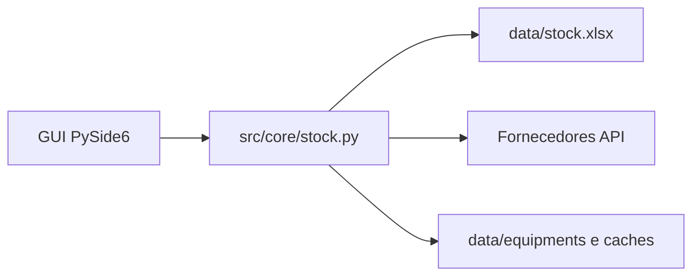

# Fluxogramas — Stock Tracker

Diagramas do fluxo da aplicação (Mermaid). Abrir no GitHub, no VS Code/Cursor (pré-visualização Markdown) ou em [mermaid.live](https://mermaid.live).

## Índice

| Ficheiro | Conteúdo |
|----------|----------|
| [01-arranque-aplicacao.md](01-arranque-aplicacao.md) | Arranque, `main.py`, janela principal |
| [02-navegacao.md](02-navegacao.md) | COMPONENTS / EQUIPMENTS, barra de ações partilhada |
| [03-components.md](03-components.md) | Pesquisa, SCAN, stock IN/OUT, catálogo, imagem |
| [04-equipments.md](04-equipments.md) | Equipamentos, imagem, documentação por pasta |
| [05-excel-dados.md](05-excel-dados.md) | `stock.xlsx`, pastas em `data/`, backups |
| [06-fornecedores-scan.md](06-fornecedores-scan.md) | Cadeia de APIs no SCAN (Components) |
| [07-popups-dialogos.md](07-popups-dialogos.md) | Popups Qt Designer ↔ Python |
| [08-qt-designer.md](08-qt-designer.md) | Workflow Designer, geradores, export |

## Legenda comum

Documentação geral: [../README.md](../README.md) · Qt Designer: [../user/QT_DESIGNER.md](../user/QT_DESIGNER.md)
