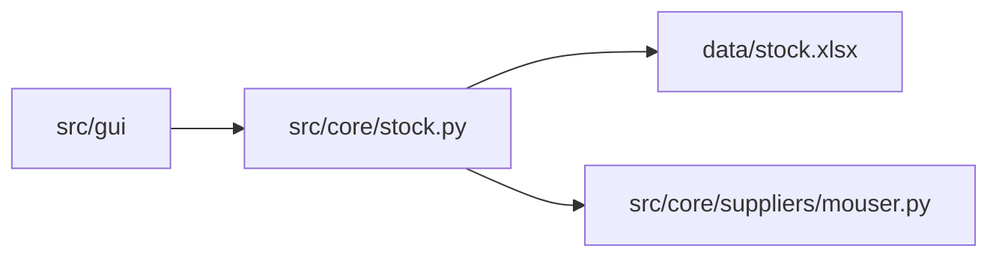

# Relatório de estágio — Stock Tracker (rascunho)

Documento de apoio para o relatório formal. Preenche as secções com o teu texto; mantém diagramas e capturas de ecrã conforme o tutor pedir.

---

## 1. Contexto e objetivos

- **Empresa / unidade:** Siemens (estágio)
- **Problema:** Gestão manual de stock de componentes eletrónicos (referências Mouser, fabricante, quantidades)
- **Objetivo da aplicação:** Inventário em Excel, movimentos IN/OUT com histórico, consulta e importação via API Mouser, interface desktop alinhada ao design Siemens

---

## 2. Arquitetura implementada

### 2.1 Separação de camadas

| Camada | Localização | Responsabilidade |
|--------|-------------|------------------|
| Entrada | `src/main.py` | Arranque PySide6 |
| Interface | `src/gui/` | Eventos, validações de utilizador, mensagens |
| Negócio | `src/core/stock.py` | Excel, stock, histórico, orquestração Mouser |
| Fornecedores | `src/core/suppliers/` | HTTP Mouser; stubs TME / Robert Mauser |
| Configuração | `config/secrets.py` | Chave API (não versionada) |
| Dados | `data/stock.xlsx` | Folhas Components e History |

### 2.2 Fluxo principal (SCAN)

1. Utilizador identifica-se (nome obrigatório)
2. Scan ou referência (mín. 5 caracteres)
3. Pesquisa no Excel (`find_component_any`)
4. Se não existir → confirmação → API Mouser → nova linha com stock 0
5. Quantidade + **ADD STOCK** → `update_stock(IN)` e registo em History

### 2.3 Diagrama (opcional no relatório final)

---

## 3. Integração Mouser

- **Estado:** Implementada e testada (`search_mouser`, opções 5 e 6 no terminal)
- **Credencial:** `MOUSER_API_KEY` em `config/secrets.py` ou variável de ambiente
- **Endpoint:** `POST` `api.mouser.com/api/v1/search/partnumber`
- **Normalização:** `src/core/suppliers/base.py` → formato comum `PartInfo`

### 3.1 DigiKey (decisão de projeto)

- Integração OAuth testada; pesquisa bloqueada no portal sandbox (403)
- **Removida do código** a pedido do utilizador — documentar como tentativa e limitação da API, não como falha da arquitetura

---

## 4. Fornecedores futuros

| Fornecedor | Estado no código |
|------------|------------------|
| Mouser | Operacional |
| TME | Stub (`tme.py`) — API possível se o tutor exigir |
| Robert Mauser | Sem API pública — entrada manual no Excel |

---

## 5. Interface gráfica

- PySide6, estilos Siemens em `src/gui/styles.py`
- Validações: utilizador, referência mínima, confirmação em remoção OUT, aviso se Excel aberto
- Templates Siemens em `src/gui/siemens_template/` (referência, não fluxo principal)

---

## 6. Testes realizados

| Método | Comando / ação |
|--------|----------------|
| GUI | `python -m src.main` ou `run.bat` |
| Terminal | `python -m src.test_terminal` (menu 1–9) |
| Mouser | Opções 5 (consulta) e 6 (importar + stock IN) |

**Registar aqui:** datas, referências testadas, capturas de ecrã, erros encontrados e correções.

---

## 7. Limitações e melhorias futuras

- Excel deve estar fechado durante gravação (`PermissionError`)
- Um fornecedor ativo (Mouser); TME por implementar
- Repositório Git/GitHub opcional — não versionar `secrets.py` nem `data/stock.xlsx`

---

## 8. Conclusão (esboço)

_Aplicação desktop funcional com separação core/GUI, inventário persistente e integração Mouser. Pronta para demonstração ao tutor; extensível a outros fornecedores via `src/core/suppliers/`._

---

## Anexos sugeridos

- Captura da janela principal
- Excerto da folha Components / History
- Lista de dependências (`requirements.txt`)
- Referência: [ARQUITETURA.md](ARQUITETURA.md), [FORNECEDORES.md](FORNECEDORES.md)
